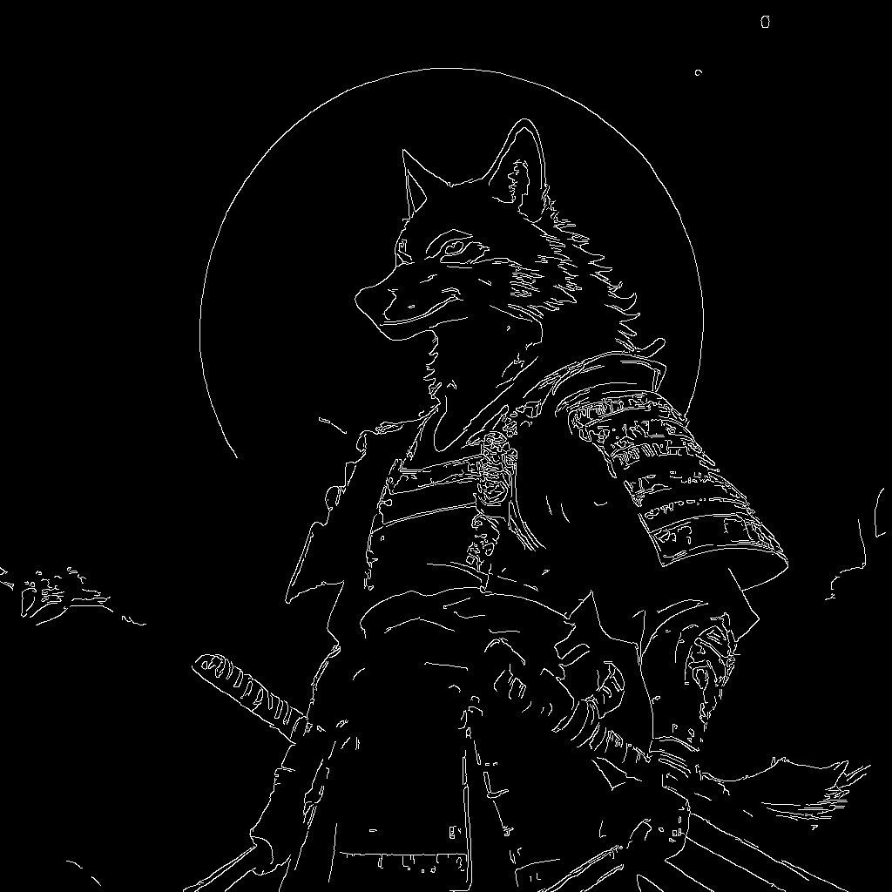
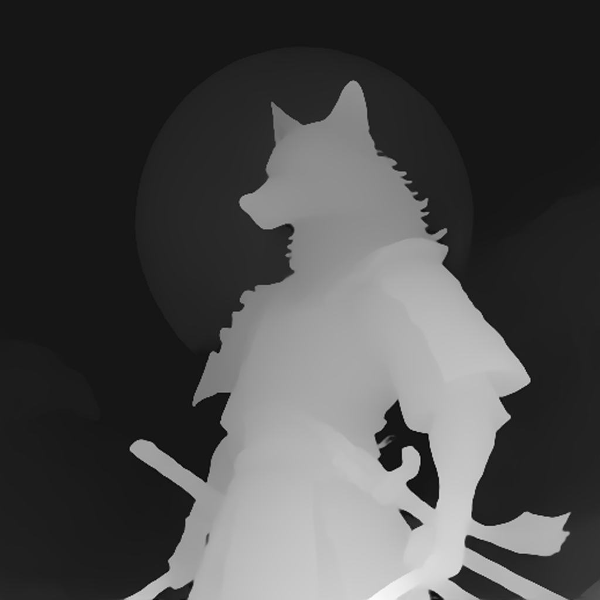

# ControlNet-LLLite for DreamLite (Non-Commercial)

A port of [kohya-ss/ControlNet-LLLite](https://github.com/kohya-ss/sd-scripts)
to [DreamLite-mobile](https://github.com/ByteVisionLab/DreamLite). Adds
ControlNet-style spatial control (canny / depth / pose) to the 4-step
DreamLite-mobile UNet via small per-attention LLLite adapters.

> **License notice:** trained adapter weights are an *Adapted Material* of
> DreamLite (CC BY-NC 4.0). Both the LLLite weights and any redistribution
> of them are bound by the same non-commercial license. The code in this
> repo (`src/`, `scripts/`, `tests/`) is Apache-2.0. See
> [`LICENSE`](./LICENSE), [`WEIGHTS_LICENSE`](./WEIGHTS_LICENSE), and
> [`ATTRIBUTION.md`](./ATTRIBUTION.md).

## What it does

```
                              cond image (canny / depth / pose)
                                     │
                                     ▼
          ┌─────────────────────────────────────┐
          │   per-block CNN encoder (depth-aware)│
          └────────────────┬────────────────────┘
                           │  cond_emb at each block resolution
                           ▼
   ┌────────────────────────────────────────────────────────────┐
   │ DreamLite-mobile UNet (frozen)                              │
   │                                                             │
   │   attn1.to_q  ─┐ │ attn2.to_q ─┐                            │
   │   attn1.to_k  ─┼─►  +δ via LLLiteModule (down → mid → up)   │
   │   attn1.to_v  ─┘   (zero-init at start of training)         │
   └────────────────────────────────────────────────────────────┘
                           │
                           ▼ noise prediction (flow matching)
```

108 LLLite modules attach to:

* `attn1.to_q`, `attn1.to_k`, `attn1.to_v` (self-attention; 72 modules)
* `attn2.to_q` only (cross-attention query; 36 modules — kohya v1 convention,
  cross-attention K/V come from text features and have a different shape).

The conditioning encoder produces an embedding at each transformer block's
spatial resolution (128 / 64 / 32 for the 1024-input case), padded with
zeros along the width axis to match DreamLite's "spatial concat" input
layout (`cat([latent, ref_image_latent], dim=W)`).

Default config: `cond_emb_dim=32`, `mlp_dim=64` → about **13.3 M trainable
parameters**.

## Quickstart

```bash
# 1. Set up env (uses DreamLite's existing Python 3.10 venv)
pip install -e .[preprocess]

# 2. Smoke test the injection on your DreamLite-mobile install
DREAMLITE_ROOT=/path/to/dreamlite python tests/test_inject_smoke.py \
    --model /path/to/DreamLite-mobile

# 3. Inference with zero-init adapter (sanity check; output == vanilla)
python scripts/infer_lllite.py --model /path/to/DreamLite-mobile \
    --prompt "a photo of a corgi"

# 4. Inference with trained adapter
python scripts/infer_lllite.py --model /path/to/DreamLite-mobile \
    --weights checkpoints/canny.safetensors \
    --cond_type canny --cond_image input.jpg \
    --prompt "a futuristic city" --out out.png
```

## Training

The recommended workflow follows kohya-ss's published LLLite recipe: train
on **synthetic images generated by the base model itself**, paired with a
conditioning image derived from the same generated image. Empirically
~3,000–4,000 generated images per ControlNet task is enough for SDXL; for
the smaller DreamLite-mobile (0.39 B) the same scale or smaller should
work.

```bash
# 1. Pull a prompt corpus (default: DiffusionDB-2M random sample, 4000 prompts)
pip install datasets
python scripts/fetch_prompts_diffusiondb.py \
    --out data/prompts.jsonl \
    --n 4000

# 2. Generate training images with DreamLite-mobile itself (~90 min on a 3090 Ti)
python scripts/generate_training_images.py \
    --model /path/to/DreamLite-mobile \
    --prompts data/prompts.jsonl \
    --out data/imgs \
    --size 1024 --steps 4

# 3. Derive conditioning images (canny/depth/pose) from the generated set
python scripts/prepare_dataset.py \
    --src data/imgs \
    --out data/canny \
    --cond_type canny --size 1024

# 4. (recommended) Cache VAE latents + Qwen3-VL embeddings once. ~3-5x faster training.
python scripts/cache_latents.py \
    --model /path/to/DreamLite-mobile \
    --manifest data/canny/manifest.jsonl \
    --cache_dir data/canny/cache \
    --size 1024 --quantize_te

# 5. Train. Defaults match kohya-ss: lr=2e-4, adamw8bit, bf16, ~12 epochs
python scripts/train_lllite.py \
    --model /path/to/DreamLite-mobile \
    --cached_manifest data/canny/cache/manifest.jsonl \
    --out_dir runs/canny \
    --cond_type canny \
    --size 1024 \
    --batch_size 2 --gradient_accumulation_steps 4 \
    --max_epochs 12 --save_every 1000 \
    --gradient_checkpointing --sample_every 500

# 6. Evaluate. Generates an HTML report with side-by-side cond/gen/target.
python scripts/eval_lllite.py \
    --weights runs/canny/lllite_canny_step012000.safetensors \
    --eval_dir data/eval \
    --cond_type canny \
    --out_dir runs/canny/eval
```

Effective batch size = `batch_size × gradient_accumulation_steps = 8`,
matching kohya-ss's recommendation.

Caption format follows kohya-ss: each image at `path/foo.png` has a sidecar
`path/foo.txt` containing the prompt that was used to generate it.

For depth: kohya-ss notes that "for some conditioning types it may be better
to halve the dimensions" — try `--cond_emb_dim 16 --mlp_dim 32 --learning_rate 1e-4`
for depth/pose.

### Tested

```
RTX 3090 Ti (24 GB), Python 3.10, torch 2.6.0+cu124
size=512  bf16 + grad checkpoint   ~1.5 s / step
size=1024 bf16 + grad checkpoint   slower (run grad_accum to amortize)
```

## Repository layout

```
.
├── src/dreamlite_lllite/
│   ├── lllite.py        # LLLiteModule + LLLiteController
│   ├── inject.py        # apply_lllite / remove_lllite, target enumeration
│   ├── pipeline.py      # DreamLiteMobileLLLitePipeline
│   └── conditioning.py  # canny / depth / pose preprocessors
├── scripts/
│   ├── infer_lllite.py
│   ├── train_lllite.py
│   └── prepare_dataset.py
└── tests/
    ├── test_inject_smoke.py    # zero-init adapter == vanilla output
    └── test_train_smoke.py     # 2-step training run
```

## Sample results

Both adapters trained for 12 epochs on 4 000 synthetic 1024² samples that
DreamLite-mobile generated from itself, then evaluated on a held-out
prompt with a fresh seed (so any structural similarity is attributable to
LLLite, not noise re-use).

### Canny

| target | conditioning | LLLite **off** (m=0) | LLLite **on** (m=0.7) |
|:---:|:---:|:---:|:---:|
|  |  |  |  |

Without LLLite, the model wanders compositionally; with the canny adapter
the wolf's pose, the moon, and the armor lines are reproduced faithfully.

### Depth

| target | conditioning | LLLite **off** (m=0) | LLLite **on** (m=0.7) |
|:---:|:---:|:---:|:---:|
|  |  |  |  |

The depth adapter pins the 3D layout — silhouette, foreground sword, and
the background moon disc all align with the depth map.

### Numerical metrics (mean over 6 holdout images)

| Conditioning | metric | m=0.0 (off) | **m=0.7** (recommended) | m=1.0 (full) |
|---|---|---|---|---|
| Canny | edge_iou (higher = better) | 0.031 | **0.113** | 0.124 |
| Depth | abs_depth_diff (lower = better) | 0.264 | **0.091** | 0.124 |

`m=0.7` is the recommended inference multiplier: for canny it keeps ~91 %
of control with crisper output, and for depth it actually *outperforms*
`1.0` because full strength tends to flatten depth variation.

Hyperparameters (12 epochs, AdamW8bit, bf16, gradient checkpointing, eff.
batch 8):
* Canny — kohya defaults: `cond_emb_dim=32, mlp_dim=64, lr=2e-4`
* Depth — half per kohya's hint: `cond_emb_dim=16, mlp_dim=32, lr=1e-4`

## Pre-trained weights are NOT distributed

DreamLite-mobile is currently in early access. To respect that, this
repository **only releases the training and inference code, not the
trained adapter weights**. Anyone with their own DreamLite-mobile copy can
reproduce the adapters by running the pipeline below; the kohya-default
recipe takes ~20 hours on a single 4060 Ti / 16 GB.

If DreamLite is later released for general use we may publish adapter
weights to Hugging Face under CC BY-NC 4.0; until then please train your
own.

## Differences from kohya-ss LLLite v1

| | kohya-ss (SDXL) | this repo (DreamLite-mobile) |
|---|---|---|
| Target UNet | SDXL `input_blocks`/`output_blocks` | diffusers `down_blocks`/`up_blocks` |
| Block depth | hardcoded {1, 2, 3} per index | derived from feature spatial size |
| Module targets | attn1.QKV + attn2.Q | same |
| Spatial concat | none | width-doubled input → cond_emb zero-padded along W |
| Cross-attn target | CLIP (768/1280) | Qwen3-VL → encoder_hid_proj 2304 (skipped — K/V) |
| Default ranks | cond_emb_dim=32, mlp_dim=64 | same |

## Limitations

* **No video / temporal support** — `Anima-LLLite` is incompatible because
  DreamLite-mobile UNet is 2D-only.
* **Cross-attention K/V are not adapter targets**, matching kohya v1.
* **Conditioning encoder is per-module, not shared.** This wastes some
  compute when adapters at the same block resolution recompute the same
  embedding. Future optimisation: share a single CNN per resolution and
  cache (would not change the on-disk format).
* **Training has only been validated end-to-end at `size=512`.** Larger
  sizes work but require more VRAM; enable `--gradient_checkpointing` and
  `--gradient_accumulation_steps`.

## Citation

If you use this work, please cite the underlying papers:

```bibtex
@article{feng2026dreamlite,
  title={DreamLite: A Lightweight On-Device Unified Model for Image
         Generation and Editing},
  author={Feng, Kailai and Wei, Yuxiang and Chen, Bo and Pan, Yang and
          Ye, Hu and Liu, Songwei and Yan, Chenqian and Gao, Yuan},
  journal={arXiv preprint arXiv:2603.28713},
  year={2026}
}

@misc{kohya-ss-lllite,
  title  = {ControlNet-LLLite},
  author = {kohya-ss},
  year   = {2023},
  url    = {https://github.com/kohya-ss/sd-scripts}
}
```
